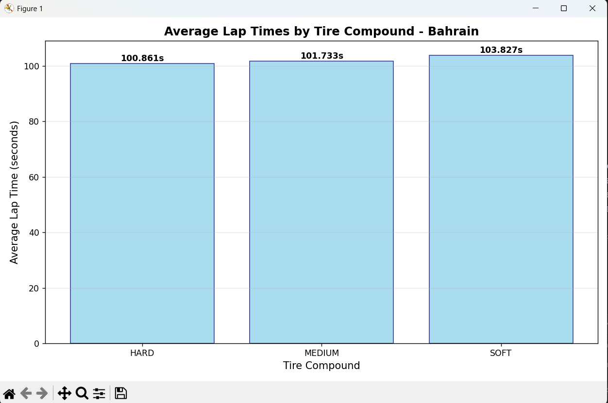
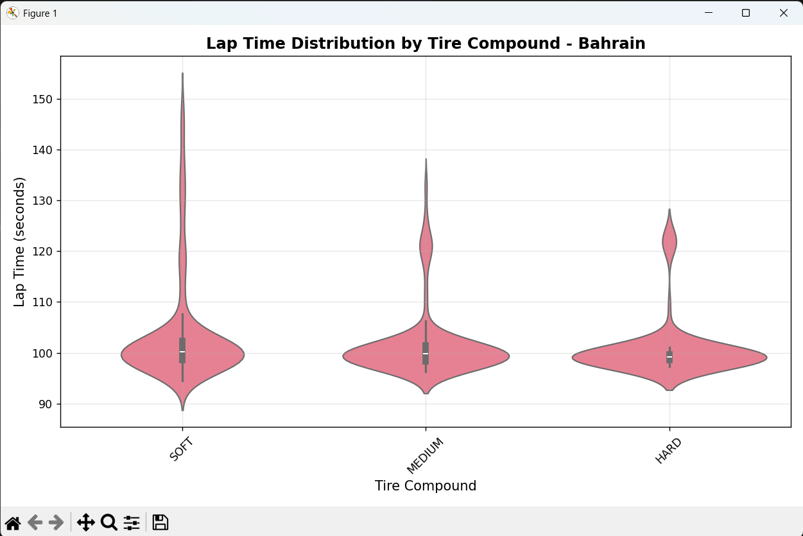
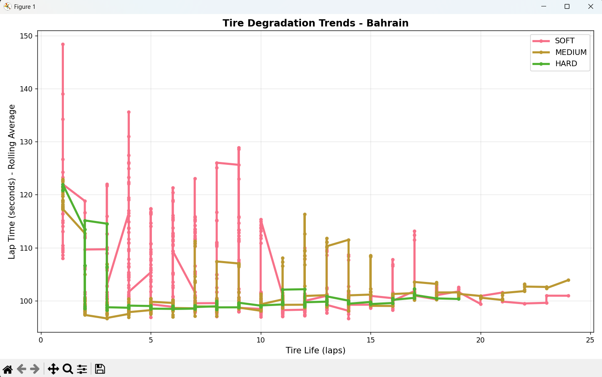

## Tyre Degradation Analysis
### After studying the different plots in the `tire_analysis_separate_plots.py` file here are some hypothesis that can be made for tyre wear/degradation

## The data of 6 races from the 2022 season was taken for a good reference. The races were:
### 1. Bahrain -> 57 Laps
### 2. Monaco -> 78 Laps
### 3. Canada -> 70 Laps
### 4. Belgium -> 44 Laps
### 5. Singapore -> 62 Laps
### 6. Brazil -> 69 Laps

### Here are the example plots

#### 1. Lap Times by Tire Compound

#### 2. Lap Time Distribution by Tire Compound

#### 3. Tire Degradation Analysis

## Hypothesis:
### 1. Tyre selection is relative to the number of laps in the race. So if the number of laps are more, it is optimal to opt for Hards or Mediums, if number of laps are less, we go for softs+hards/mediums

### 2. Tyre degradation for hards or mediums is higher on longer tracks then for softs

### 3. Hard and Medium tyres give a better average lap time as the number of lap increases for any race